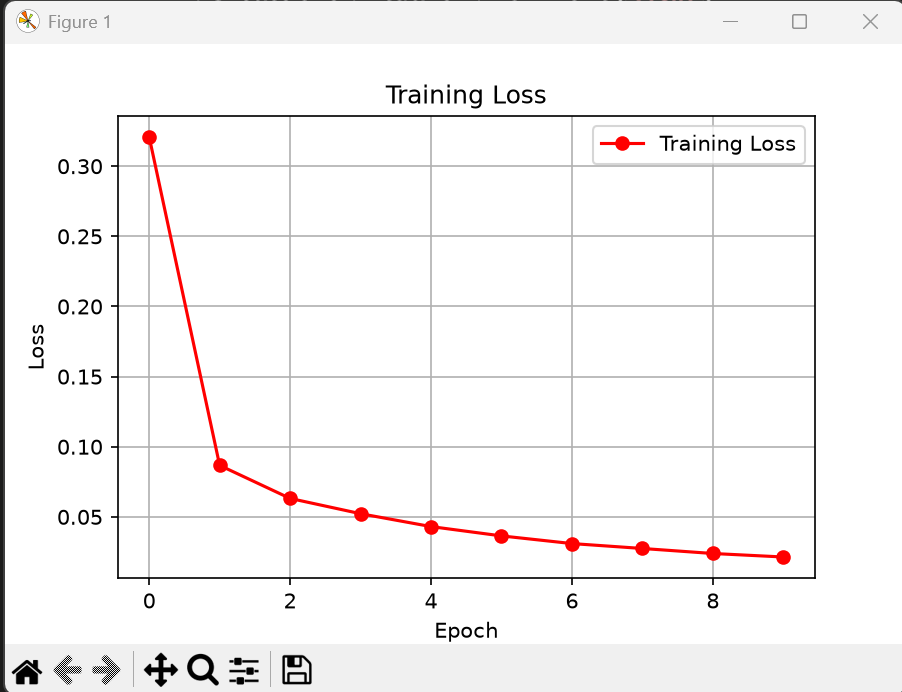
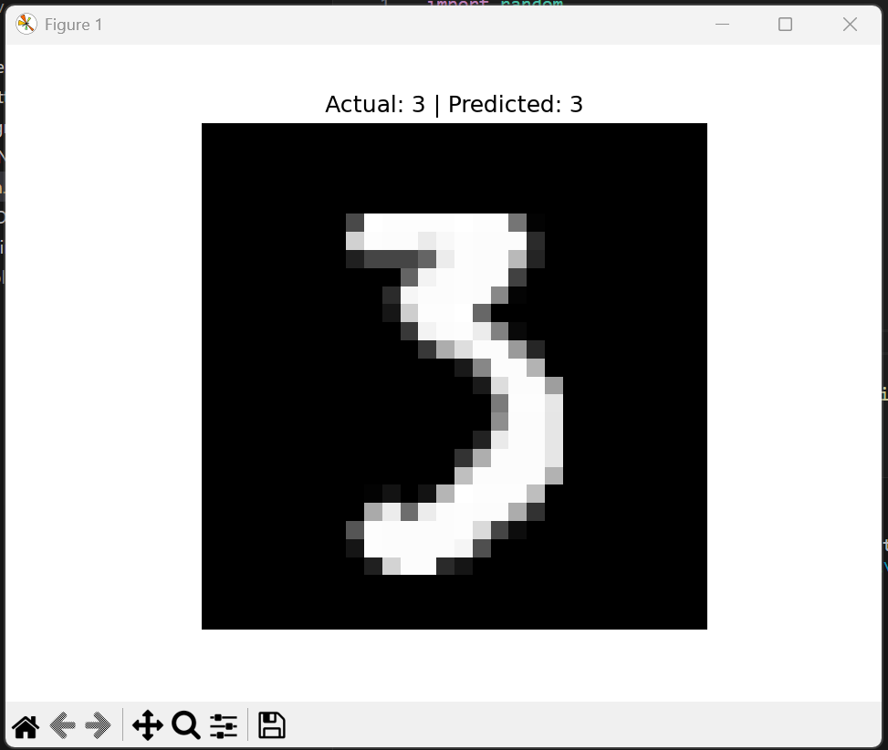
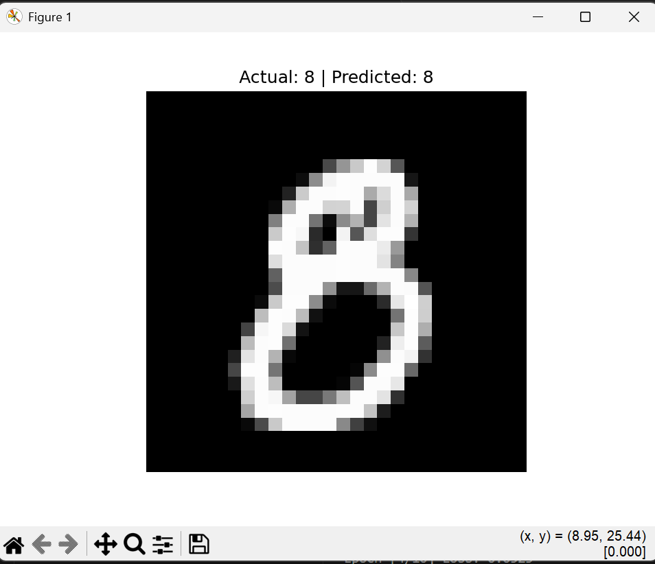
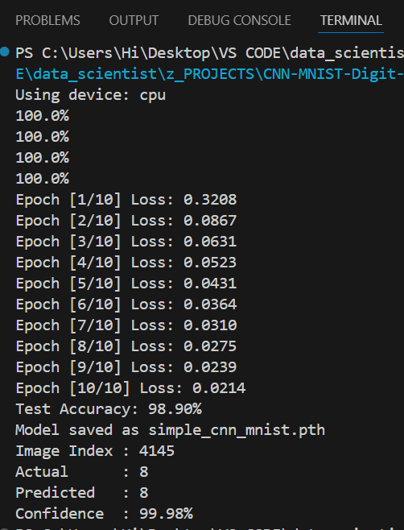

# 🔢 CNN MNIST Digit Classifier

A **Convolutional Neural Network (CNN)** built with PyTorch that classifies handwritten digits (0–9) from the MNIST dataset — achieving **98.90% test accuracy**. This project is an upgrade from a fully-connected ANN baseline, using convolutional layers to better capture spatial patterns in digit images.


---

## 📖 About

This project trains a simple CNN from scratch to recognize handwritten digits from the classic MNIST dataset. It builds on a prior ANN-based digit classifier, replacing fully-connected layers with convolutional + pooling layers to improve feature extraction and boost accuracy. The script supports both training a new model and loading a previously saved one via a single flag, so retraining isn't required every run.

**Key highlights:**
- Custom CNN architecture (2 conv blocks + fully connected classifier head)
- 98.90% accuracy on the MNIST test set after 10 epochs
- Training loss visualization with Matplotlib
- Model save/load flag to skip retraining
- Live single-image prediction with confidence score

---

## 🧠 Model Architecture

```
Input:  1 × 28 × 28  (grayscale digit image)

Conv Block 1:
  Conv2d(1 → 8, kernel=3, padding=1) → ReLU → MaxPool2d(2)

Conv Block 2:
  Conv2d(8 → 16, kernel=3, padding=1) → ReLU → MaxPool2d(2)

Flatten:  16 × 7 × 7 = 784

Classifier:
  Linear(784 → 64) → ReLU → Linear(64 → 10)
```

**Loss Function:** CrossEntropyLoss
**Optimizer:** Adam (lr = 0.001)
**Epochs:** 10

---

## 📊 Results

| Metric | Value |
|---|---|
| Test Accuracy | **98.90%** |
| Final Training Loss | 0.0214 |
| Epochs | 10 |

### Training Loss Curve
<p align="center">
  
</p>

Loss dropped sharply after the first epoch and steadily converged, showing stable learning with no signs of overfitting across the 10 epochs.

### Sample Predictions
<p align="center">
  
  
</p>

### Training Log
<p align="center">
  
</p>

---

## 🚀 Getting Started

### 1. Clone the repository
```bash
git clone https://github.com/talha-siddiqui137/CNN-MNIST-Digit-Classifier.git
cd CNN-MNIST-Digit-Classifier
```

### 2. Create a virtual environment
```bash
python -m venv .venv
.venv\Scripts\activate      # Windows
source .venv/bin/activate   # macOS/Linux
```

### 3. Install dependencies
```bash
pip install -r requirements.txt
```

### 4. Run the script
```bash
python main.py
```

---

## ⚙️ Train vs. Load Saved Model

At the top of `main.py`:

```python
TRAIN = True   # Train from scratch, save model + show loss graph
TRAIN = False  # Skip training, load the saved simple_cnn_mnist.pth instead
```

- Set `TRAIN = True` the first time (or whenever retraining is needed).
- Set `TRAIN = False` afterward to instantly load saved weights and jump straight to a random prediction — no waiting on epochs.

---

## 📁 Project Structure

```
CNN-MNIST-Digit-Classifier/
├── screenshots/               # Training logs & sample outputs
├── main.py                    # Training / loading / evaluation script
├── simple_cnn_mnist.pth        # Saved trained model weights (gitignored)
├── requirements.txt            # Project dependencies
├── LICENSE
└── README.md
```

---

## 🛠️ Tech Stack

- **PyTorch** — model building & training
- **Torchvision** — MNIST dataset & transforms
- **Matplotlib** — loss curves & prediction visualization
- **Python 3.14**

---

## 📌 Future Improvements

- [ ] Add batch normalization and dropout to reduce overfitting risk further
- [ ] Add a confusion matrix for per-class error analysis
- [ ] Experiment with deeper architectures / data augmentation
- [ ] Wrap inference in a simple web app (Streamlit/Gradio) for interactive digit drawing + prediction
- [ ] Add validation split alongside training/test for better monitoring

---

## 👤 Author

**Talha Siddiqui**
Software Engineering student — AI/ML & Data Science

- GitHub: [@talha-siddiqui137](https://github.com/talha-siddiqui137)
- LinkedIn: [talha-siddiqui137](https://linkedin.com/in/talha-siddiqui137)
- Email: talha03182301690@gmail.com

---

## 📄 License

This project is licensed under the **MIT License** — see the [LICENSE](LICENSE) file for details.
